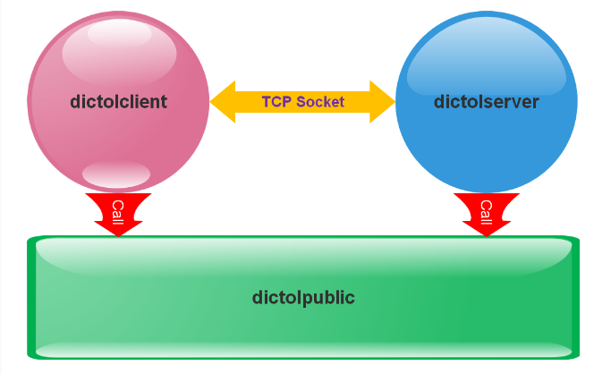

# 项目介绍：

项目作为网络socket，数据库sqlite，文件IO 的最小模型代码；

核心功能：客户端给服务器发送一个单词，然后服务器回给客户端该单词的英文释义

附加功能：

1. 注册用户
  2. 登录用户
  3. 查阅用户对应的搜词历史
  4. 查阅单词

关键字：socket，C，sqlite，IO，




# 当前进度

1. ok登录用户
2. ok查阅单词
3. todo 注册用户
4. todo  查询用户对应搜词历史


# 待修改内容

1. 数据库初始化提取变成功能，不要每次打开服务器都进行初始化
2. 客户端界面的优化
3. 删除掉debug调试 print输出的内容

# 当前结构

服务端采用四侧/三层模型的方式进行架构分类

1. main  事件监听
2. controller  信号处理
3. service   服务封装
4. dao 数据库处理


客户端采用的二/三层模型进行架构分类

1. main
2. view   显示层函数
3. controller 事件处理 （包含model  数据来源 ）


```

├── :Files
├── README.md
├── db
│   └── createTable.sql   初始化表的sql语句
├── dic.db
├── git_new.sh
├── inc
│   ├── ClientSocket.h
│   ├── ClientView.h
│   ├── HistoryDao.h
│   ├── HistoryService.h
│   ├── ServerController.h
│   ├── UserDao.h
│   ├── UserService.h
│   ├── WordService.h
│   ├── controller.h
│   ├── dictoldebug.h
│   ├── dictolprotocol.h 
│   ├── dictolpublic.h
│   ├── serverSocket.h   
│   └── sqliteDrive.h
├── lib
└── src
    ├── client
    │   ├── Model     我封装在controller函数里没有进行分离，即socket内容
    │   ├── cmain.c	   客户端的main函数
    │   ├── controller 组装函数文件
    │   │   └── controller.c 
    │   ├── makefile	        客户端makefile
    │   ├── util  工具文件
    │   │   └── ClientSocket.c   客户端发送工具
    │   └── view
    │       └── view.c           服务端显示界面函数
    ├── dic.db
    ├── public
    │   ├── dictolprotocol.c   客户端和服务端通信协议文件
    │   └── dictolpublic.c   文件读取工具函数
    └── server
        ├── DAO
        │   ├── HistoryDao.c    历史表操作
        │   └── UserDao.c 	 	用户表操作
        ├── SERVICE
        │   ├── HistoryService.c     历史表操作服务函数
        │   ├── UserService.c		 用户表操作服务函数
        │   └── WordService.c		文件查找操作服务函数
        ├── Util  工具
        │   ├── ServerSocket.c     服务器socket工具
        │   └── sqliteDriver.c     sqlite驱动工具
        ├── controller
        │   └── ServerController.c     服务器端拼装函数
        ├── dic.db                服务器的数据库文件
        ├── dict.txt	         字典的数据文件
        ├── makefile			服务器makefile
        └── smain.c             服务器main函数

15 directories, 39 files
```


## 2.1 原始结构

```
└── dictol_src_dir
    ├── inc
    │   ├── dictoldebug.h
    │   ├── dictolprotocol.h
    │   └── dictolpublic.h
    ├── lib
    └── src
        ├── client
        ├── public
        │   ├── dictolprotocol.c
        │   └── dictolpublic.c
        └── server
            └── dict.txt
```


通信

## 2.2 通信协议数据组织

用变长结构体来组织通过TCP传输的数据

```
struct DictOLPDU
{
	int len;
	int type;//1 reg-req 2. reg-rsp 3. login-req 4. login-rsp 5. searchword-req 6. searchword-rsp 7. history-req 8. history-rsp 
	char data[1];
};
```

type --- 1: 20字节用户名+20字节密码

type ----2 ：4字节的整数（0为OK，其它数字表示错误）

type ----3：20字节用户名+20字节密码

type ---- 4：4字节的整数（0为OK，其它数字表示错误）

type ----5：存放被搜单词（字符串）

type ----6：存放释义（字符串）

type ---- 7：不用data

type ---- 8：方案1----分开发送，每条历史记录发送一次，每次pdu的data部分组织为：前20字节为用户名，然后的24字节的时间字符串，最后是不定长的单词(历史记录分开发送)，最后发送一条空记录表示全部发送完毕，空记录的data 第一个字符如果为'\0'（历史记录的结束）

​                    方案2-----所有结果组织在一起，统一发送，data部分为'\0'结尾的字符串，该字符串中用'#'分隔单词和时间，用‘@’分隔不同历史记录


## 2.3 dictolpublic:在线词典公共模块

本模块编译成动态库文件：libdictolpublic.so

主要给客户端和服务器提供：

	1. 双方通信协议数据组织相关的函数
	2. 发送接收协议数据的函数
	3. 通信双方都可能用到的其它设施：如，一些配置宏、调式宏、一些简易封装函数

模块源码文件组成：

1. dictolprotocol.c：各种PDU数据组织函数，SendPDU、RecvPDU函数，DestroyDictOLPDU函数

  2. dictolpublic.c：对read、write的二次封装函数，对fgets的二次封装函数
  3. 对外头文件：
     	1. dictoldebug.h ：各模块调试用宏
     	2. dictolprotocol.h：PDU变长结构体设计，dictolprotocol.c对外函数声明
     	3. dictolpublic.h：包含上面两个头文件，dictolpublic.c对外函数声明

